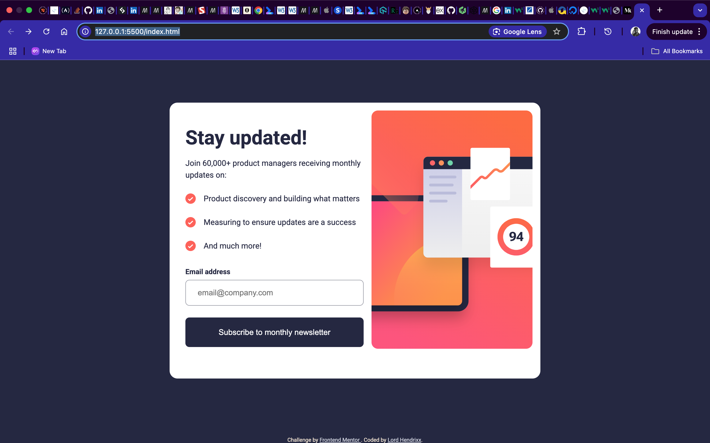

# Frontend Mentor - Newsletter sign-up form with success message solution

This is a solution to the [Newsletter sign-up form with success message challenge on Frontend Mentor](https://www.frontendmentor.io/challenges/newsletter-signup-form-with-success-message-3FC1AZbNrv). Frontend Mentor challenges help you improve your coding skills by building realistic projects. 

## Table of contents

- [Overview](#overview)
  - [The challenge](#the-challenge)
  - [Screenshot](#screenshot)
  - [Links](#links)
- [My process](#my-process)
  - [Built with](#built-with)
  - [What I learned](#what-i-learned)
  - [Continued development](#continued-development)
  - [Useful resources](#useful-resources)
- [Author](#author)
- [Acknowledgments](#acknowledgments)

**Note: Delete this note and update the table of contents based on what sections you keep.**

## Overview

### The challenge

Users should be able to:

- Add their email and submit the form
- See a success message with their email after successfully submitting the form
- See form validation messages if:
  - The field is left empty
  - The email address is not formatted correctly
- View the optimal layout for the interface depending on their device's screen size
- See hover and focus states for all interactive elements on the page

### Screenshot

### Links

- Solution URL: [VERCEL](https://your-solution-url.com)
- Live Site URL: [PORT 5500](http://127.0.0.1:5500/index.html)

## My process

### Built with

- Semantic HTML5 markup
- CSS custom properties
- Flexbox
- CSS Grid
- Mobile-first workflow

### What I learned
I learnt about the importance of Javascript form validation on form elements to ensure that bugs are gotten rid of when user inputs are introduced and also best practices on form validation as well.

### Continued development

I'd like to be tested on Javascript form validation on future projects.

### Useful resources

- [Stack Overflow](https://www.stackoverflow.com)
- [FreeCodeCamp](https://www.freecodecamp.org)

## Author
- Frontend Mentor - [Lord Hendrixx](https://www.frontendmentor.io/profile/beeAlmighty)
- Twitter - [Maduakonam Moses](https://www.twitter.com/Maduakonam67451)

## Acknowledgments
I would like to appreciate Stackoverflow and Freecodecamp for their help especially with the Javascript form validation.
